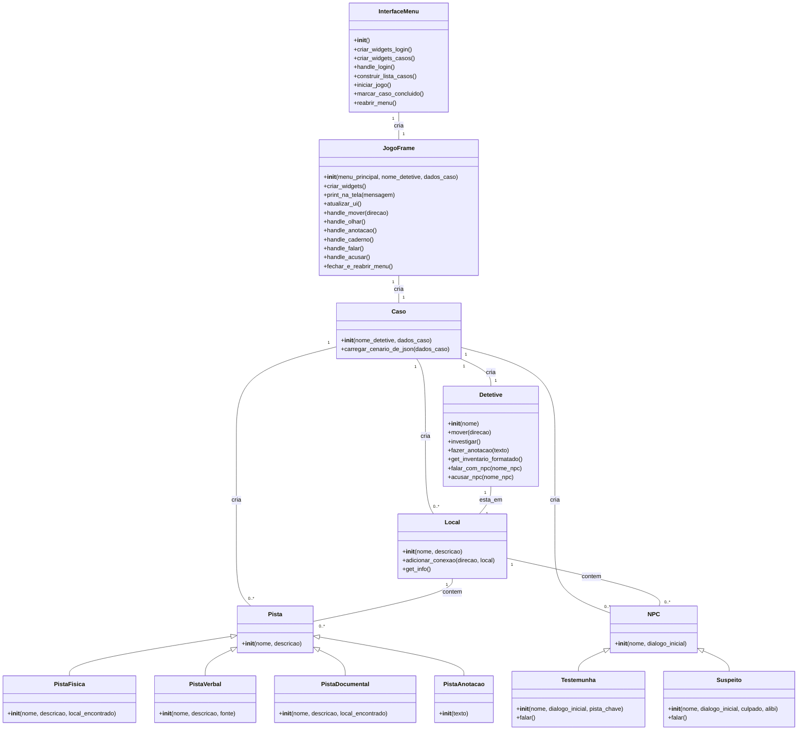

# VERITAS - Divisão de Assuntos Acadêmicos

VERITAS é um jogo de mistério e detetive baseado em texto, onde o jogador assume o papel de um detetive para resolver casos intrigantes. O jogo apresenta uma interface gráfica construída com CustomTkinter e uma narrativa ramificada que se desenrola com base nas ações do jogador.

## Como executar

1. **Clone o repositório:**
   ```bash
   git clone https://github.com/seu-usuario/veritas.git
   cd veritas
   ```

2. **Instale as dependências:**
   Este projeto requer Python 3 e as seguintes bibliotecas:
   - `customtkinter`
   - `Pillow` (para manipulação de imagem)

   Instale-os usando pip:
   ```bash
   pip install customtkinter pillow
   ```

3. **Execute o jogo:**
   ```bash
   python main.py
   ```

## Diagrama de Classes


