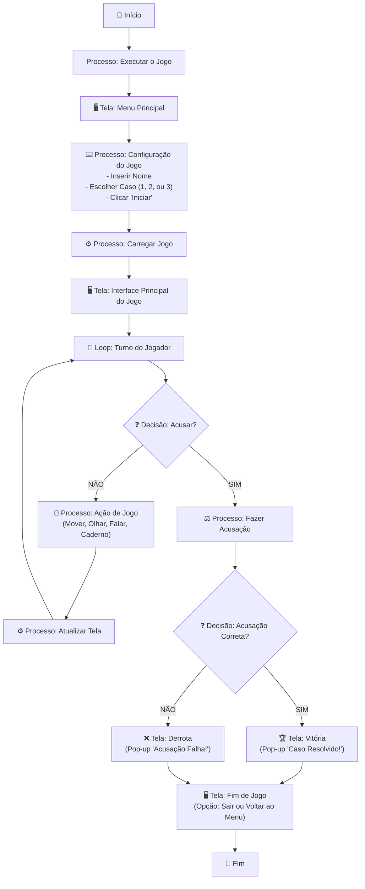

```mermaid
graph TD
    A[🏁 Início] --> B["Processo: Executar o Jogo"];
    B --> C["🖥️ Tela: Menu Principal"];
    C --> D["⌨️ Processo: Configuração do Jogo<br/>- Inserir Nome<br/>- Escolher Caso (1, 2, ou 3)<br/>- Clicar 'Iniciar'"];
    D --> E["⚙️ Processo: Carregar Jogo"];
    E --> F["🖥️ Tela: Interface Principal do Jogo"];
    F --> G["🔄 Loop: Turno do Jogador"];
    
    G --> H{"❓ Decisão: Acusar?"};
    
    H -- NÃO --> I["🖱️ Processo: Ação de Jogo<br/>(Mover, Olhar, Falar, Caderno)"];
    I --> J["⚙️ Processo: Atualizar Tela"];
    J --> G;

    H -- SIM --> K["⚖️ Processo: Fazer Acusação"];
    K --> L{"❓ Decisão: Acusação Correta?"};
    
    L -- SIM --> M["🏆 Tela: Vitória<br/>(Pop-up 'Caso Resolvido!')"];
    L -- NÃO --> N["❌ Tela: Derrota<br/>(Pop-up 'Acusação Falha!')"];
    
    M --> O["🖥️ Tela: Fim de Jogo<br/>(Opção: Sair ou Voltar ao Menu)"];
    N --> O;
    
    O --> P[🏁 Fim];
    
```